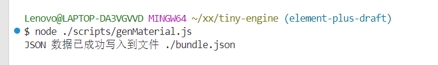
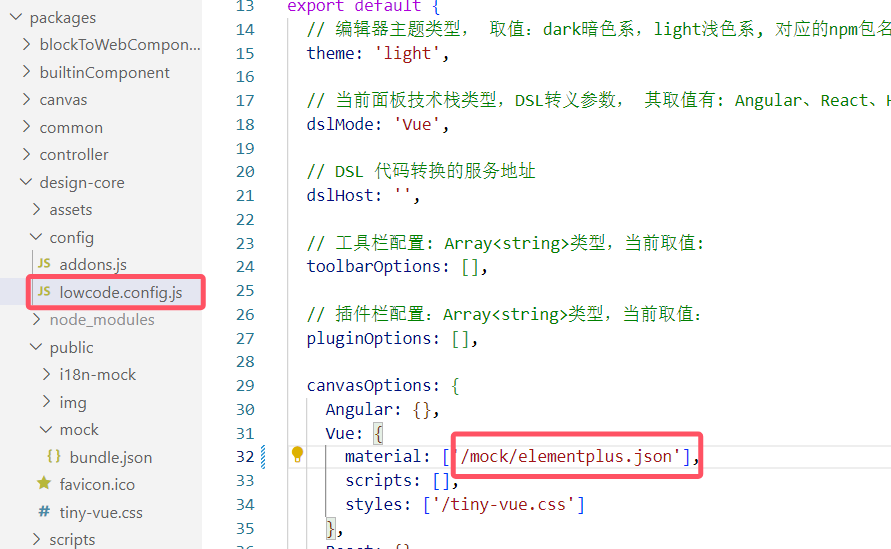
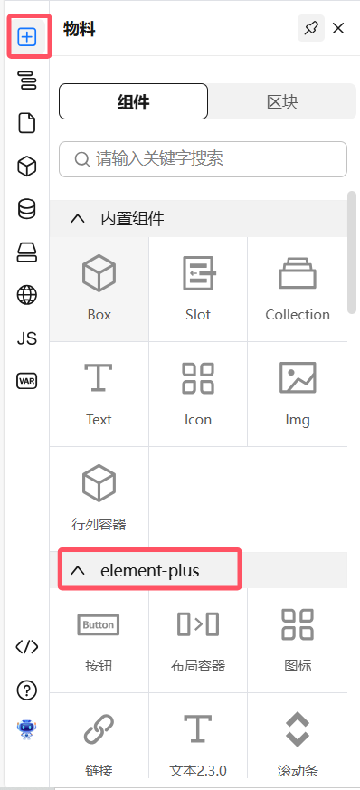
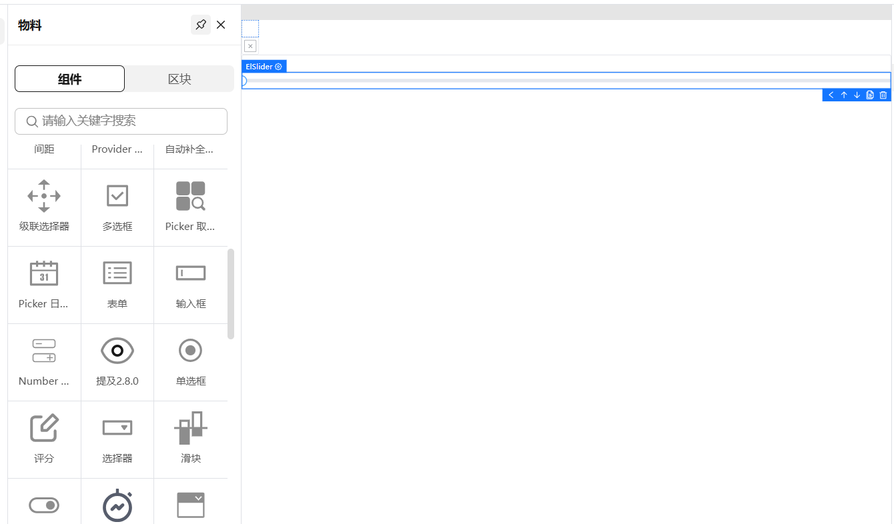
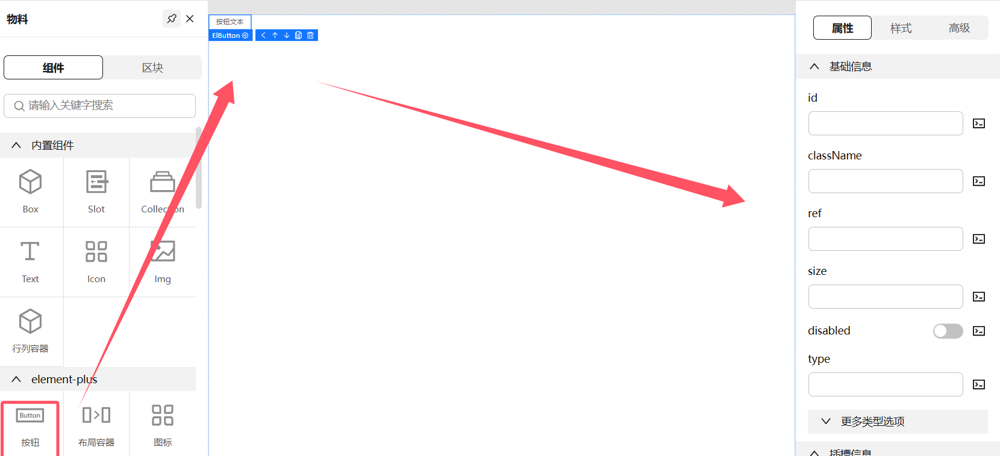
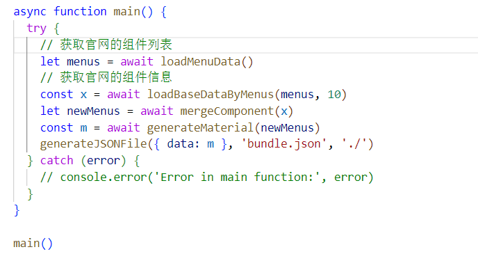
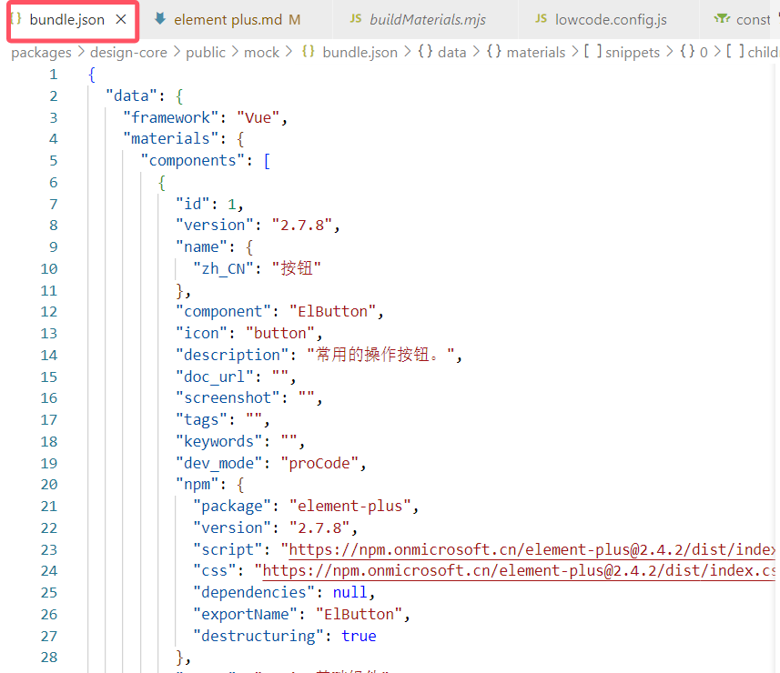

# Element Plus组件物料文档

## 使用手册

### 自动化脚本使用

在项目根目录打开shell，执行下面命令生成物料文件：
```shell
node ./scripts/genMaterial.js
```


物料文件bundle.json会自动生成到根目录中

### 物料文件使用
将生成的物料文件bundle.json重命名为elementplus.json,我们再packages\design-core\config目录下lowcode.config.js的文件中material中的'/mock/bundle.json'修改为'/mock/elementplus.json'。

执行pnpm dev启动项目，进入网页，刷新之后，第一步点击“+”号，可以看到elementplus的所有组件。


第二步，可以先清空页面，选择自己所需的组件拖拽至空白处即可实现对应功能。

第三步，可以通过右侧属性面板配置属性。


## 自动化脚本流程与原理


1. 获取组件菜单：

- 通过 loadMenuData() 从官网获取所有组件的概览和链接。加载组件详细信息：
- 使用 loadBaseDataByMenus() 并发请求每个组件的详细信息，包括组件的描述和属性表格。
2. 合并组件信息：

- mergeComponent() 将 Element Plus 的组件与提取的数据合并，确保获取完整的组件信息。

3. 生成结构化材料：

- 通过 generateMaterial() 创建结构化的材料，包括组件、代码片段
等。

4. 输出结果：

- 最后将生成的 JSON 数据保存到文件 bundle.json 中，方便后续使
用。
